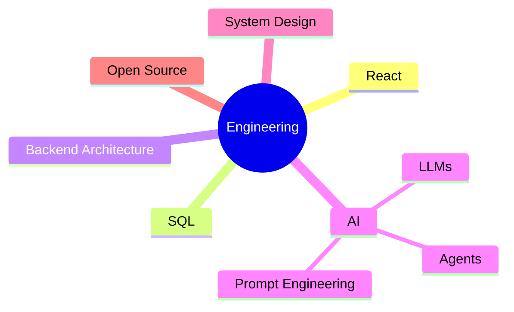

[GitHub_README_Notes.docx](https://github.com/user-attachments/files/29703640/GitHub_README_Notes.docx)


<div align="center">

# 𝙋𝙧𝙖𝙠𝙝𝙖𝙧 𝙍𝙖𝙞

### Engineering experiences, not just applications.


<br>

[](#)
[](https://www.linkedin.com/in/prakhar-kaushik-38731828b)
[](https://www.instagram.com/prakhareverie/)
[](https://leetcode.com/u/C9VARm6TAc/)
[](https://www.youtube.com/@yourwaifurim)

<br><br>


</div>

---

# About Me

```cpp
class PrakharRai {

public:

    string role = "Open Source Developer";

    string education =
        "Diploma in Computer Science Engineering";

    string college =
        "Amity University";

    int graduation = 2027;

    vector<string> interests = {

        "Artificial Intelligence",

        "Full Stack Development",

        "Automation",

        "Open Source",

        "System Design"

    };

    vector<string> currentlyLearning = {

        "React",

        "SQL",

        "Machine Learning",

        "Modern Backend Development"

    };

    string mission =
        "Engineering experiences, not just applications.";

};
```

---

<div align="center">

## Current Focus

</div>

- 🚀 Building **AMISPHERE** — Smart Academic Management Platform

- 🏠 Designing **NOOQ** — Student Hostel Discovery Platform

- 🤖 Exploring AI Agents and intelligent automation

- 📚 Learning React, SQL and Machine Learning

- 🌍 Looking to contribute more to Open Source

- 💡 Building products that solve real problems instead of tutorial clones

---

<div align="center">

# Featured Projects

</div>

## 🌐 AMISPHERE

> Digital Academic Ecosystem

A modern academic management platform designed for colleges with role-based dashboards, attendance management, smart requests, analytics and scalable architecture.

**Tech**

`React`

`Node.js`

`JavaScript`

`Tailwind CSS`

`Firebase`

---

## 🏠 NOOQ

> Student Living Reimagined

A hostel discovery platform helping students find the perfect accommodation through better search, filters and UI.

---

## 🌦 WeatherSphere

Minimal weather application focused on smooth interactions and clean design.

---

## 💬 EchoLetter

A modern messaging concept inspired by handwritten conversations with a minimal interface.

---

## 🤖 AI Experiments

Personal playground for LLMs, automation, APIs and intelligent workflows.

---

<div align="center">

# Tech Stack

</div>

### Languages

<p>


</p>

### Frontend

<p>


</p>

### Backend

<p>


</p>

### AI

<p>


</p>

Gemini API • AI Agents • LLMs • Prompt Engineering

### Tools

<p>


</p>

---
<div align="center">

# GitHub Analytics


</div>

<br>

<div align="center">


</div>

---

<div align="center">

# Contribution Activity

</div>

[](https://github.com/prakharrai12)

---

<div align="center">

# Contribution Snake


</div>

> **⚠️ Note:** The snake won't appear until we add the GitHub Action workflow (I'll generate that in the next phase).

---

<div align="center">

# GitHub Trophies


</div>

---

<div align="center">

# 2026 Roadmap

</div>

```text
██████████████████████████░░░░░░░░

✓ Java
✓ C++
✓ Python
✓ Git & GitHub

███████████████░░░░░░░░░░░░░░░░░░░

► React

██████████░░░░░░░░░░░░░░░░░░░░░░░░

► SQL

████████░░░░░░░░░░░░░░░░░░░░░░░░░░

► AI / Machine Learning

██████░░░░░░░░░░░░░░░░░░░░░░░░░░░░

► Open Source Contributions

████░░░░░░░░░░░░░░░░░░░░░░░░░░░░░░

► Portfolio Website
```

---

<div align="center">

# Current Objectives

</div>

- 🚀 Build **AMISPHERE** into a production-ready platform.
- 🤝 Make meaningful open-source contributions.
- 📚 Master React, SQL, and backend architecture.
- 🧠 Deepen my understanding of AI & Machine Learning.
- 💼 Secure impactful internship opportunities.
- 🌍 Build software that solves real-world problems.

---

<div align="center">

# Philosophy

</div>

> *"Technology isn't just about writing code—it's about creating experiences that people genuinely enjoy using."*

---

<div align="center">

# Let's Connect

<a href="https://github.com/prakharrai12">

</a>

<a href="https://www.linkedin.com/in/prakhar-kaushik-38731828b">

</a>

<a href="https://www.instagram.com/prakhareverie/">

</a>

<a href="https://leetcode.com/u/C9VARm6TAc/">

</a>

<a href="mailto:prakhar1532006@gmail.com">

</a>

<a href="https://www.youtube.com/@yourwaifurim">

</a>

</div>

---

<div align="center">

### Thanks for stopping by.

*"Building products with intention. Learning continuously. Contributing openly."*

</div>

<!--
⠀⠀⠀⠀⠀⠀⠀⠀⠀⠀⠀⠀⠀⠀⠀⠀⠀⠀⠀⠀⠀⠀⠀⠀⠀⠀⠀⠀⠀⠀⠀⠀
If you're reading the source code...
Thanks for visiting my profile.
Have an amazing day. 🚀
⠀⠀⠀⠀⠀⠀⠀⠀⠀⠀⠀⠀⠀⠀⠀⠀⠀⠀⠀⠀⠀⠀⠀⠀⠀⠀⠀⠀⠀⠀⠀⠀
-->

---

<div align="center">

# Currently Building

</div>

<table>
<tr>
<td width="50%">

## 🌐 AMISPHERE

A next-generation academic ecosystem focused on simplifying student and faculty workflows.

**Current Progress**

- Authentication System
- Attendance Module
- Faculty Dashboard
- Student Dashboard
- Admin Portal
- AI Integration

</td>

<td width="50%">


</td>
</tr>
</table>

---

<div align="center">

# Engineering Timeline

</div>

```text
2024

Started Diploma in Computer Science Engineering

↓

Learned C & C++

↓

Built First Websites

↓

Discovered Open Source

━━━━━━━━━━━━━━━━━━━━━━━━━━━

2025

JavaScript

Node.js

MongoDB

Git & GitHub

WeatherSphere

AI Experiments

━━━━━━━━━━━━━━━━━━━━━━━━━━━

2026

AMISPHERE

NOOQ

React

SQL

Machine Learning

━━━━━━━━━━━━━━━━━━━━━━━━━━━

2027 →

Internships

Open Source

Portfolio

Microsoft

Startup Journey
```

---

<div align="center">

# What I'm Learning

</div>

| Technology | Progress |
|------------|---------:|
| React | ████████░░ 80% |
| SQL | ██████░░░░ 60% |
| Node.js | ████████░░ 80% |
| Express | ███████░░░ 70% |
| MongoDB | ███████░░░ 70% |
| Machine Learning | ████░░░░░░ 40% |
| System Design | ███░░░░░░░ 30% |

---

<div align="center">

# Development Principles

</div>

> Write maintainable code.

> Build for people, not just browsers.

> Learn continuously.

> Prefer simplicity over unnecessary complexity.

> Contribute back to the community.

---

<div align="center">

# Current Workspace

</div>

```yaml
Editor: VS Code

OS: Windows

Version Control: Git + GitHub

Design: Figma

API Testing: Postman

Learning:
  - React
  - SQL
  - AI / ML

Current Focus:
  - Full Stack Development
  - Open Source
  - AI Applications
```

---

<div align="center">

# Open Source

I'm always interested in collaborating on projects related to:

🟡 Artificial Intelligence

🟡 Full Stack Development

🟡 Student-focused Platforms

🟡 Developer Tools

🟡 Automation

🟡 UI/UX

Feel free to reach out if you'd like to collaborate.

---

<div align="center">

# Support My Journey

If one of my projects helps you,
consider leaving a ⭐ on the repository.

It helps more than you think.

</div>

---

<div align="center">


</div>

---

<div align="center">

# Selected Work

*"Every project is another step toward building software that genuinely improves people's lives."*

</div>

<br>

## 🌐 AMISPHERE

### Smart Academic Management Ecosystem

A modern academic platform built to simplify how students, faculty, HODs and administrators interact.

### Highlights

- Multi-role authentication
- Attendance Management
- Student Requests
- Faculty Dashboard
- HOD Analytics
- Admin Control Panel
- AI Ready Architecture
- Modern UI

**Stack**

<p>

</p>

---

## 🏠 NOOQ

### Student Living. Reinvented.

A modern accommodation discovery platform designed specifically for students.

Instead of endless searching,
NOOQ focuses on

✔ Better Discovery

✔ Cleaner UI

✔ Smart Filters

✔ Location-first Experience

✔ Better Student Decision Making

Current Status

```
█████████████░░░░░░░░░

In Active Development
```

---

## 🌦 WeatherSphere

Weather information shouldn't feel boring.

WeatherSphere combines

• Modern UI

• Beautiful Icons

• Smooth Animations

• Fast API Integration

• Responsive Design

to create an enjoyable weather experience.

---

## 💬 EchoLetter

*"Messages that feel like letters."*

A communication concept focused on slowing conversations down instead of speeding them up.

Features include

• Minimal Interface

• Beautiful Typography

• Thoughtful UX

• Personal Conversations

---

## 🤖 AI Experiments

A collection of experiments involving

- AI Agents
- Gemini API
- Prompt Engineering
- Workflow Automation
- Intelligent Interfaces

Every experiment helps me understand how AI can become genuinely useful instead of simply impressive.

---

<div align="center">

# What I'm Interested In

</div>

```text
Artificial Intelligence
█████████████████████

Full Stack Development
██████████████████

Developer Experience
████████████████

System Design
█████████████

Automation
██████████████

Open Source
██████████████████
```

---

<div align="center">

# Current Learning Roadmap

</div>



---

<div align="center">

# Development Philosophy

</div>

> Build products that people remember.

> Keep learning.

> Stay curious.

> Ship consistently.

> Contribute openly.

> Design with intention.

---

<div align="center">

# Looking For

🤝 Open Source Collaboration

💼 Internship Opportunities

🚀 Startup Projects

🧠 AI Development

🌍 Full Stack Development

</div>

---
---

<div align="center">

# NOW

</div>

```yaml
Currently Building:
  - AMISPHERE
  - NOOQ

Currently Learning:
  - React
  - SQL
  - Machine Learning
  - Backend Architecture

Current Goal:
  - Become an exceptional software engineer.

Long Term Vision:
  - Build products that improve people's lives.
```

---

<div align="center">

# Engineering Principles

</div>

<table>

<tr>

<td width="33%" align="center">

## Simplicity

I believe software should solve problems without making users think.

</td>

<td width="33%" align="center">

## Quality

Clean architecture scales.

Quick hacks don't.

</td>

<td width="33%" align="center">

## Consistency

Small improvements every day become extraordinary over time.

</td>

</tr>

</table>

---

<div align="center">

# Beyond Code

</div>

I enjoy building interfaces that feel effortless.

For me,

great software isn't just about functionality—

it's about how it makes people feel.

That's why I enjoy combining

- Engineering

- Design

- User Experience

- AI

into products people actually enjoy using.

---

<div align="center">

# Fun Facts

</div>

```text
Favorite Theme
──────────────
Dark Mode 🌑

Coffee Level
──────────────
██████████

Preferred Editor
──────────────
VS Code

Favorite Stack
──────────────
React + Node.js

Dream Workspace
──────────────
Apple-like minimal desk

Current Mission
──────────────
Build software worth remembering.
```

---

<div align="center">

# My Development Process

</div>

```text
Idea

↓

Research

↓

Design

↓

Prototype

↓

Build

↓

Break Everything 😂

↓

Debug

↓

Ship

↓

Improve Again
```

---

<div align="center">

# Let's Build Something Amazing

</div>

Whether it's

🚀 Open Source

🧠 AI

🌐 Web Development

💼 Internship Opportunities

or simply discussing technology,

I'd love to connect.

---

<div align="center">

<a href="mailto:prakhar1532006@gmail.com">

</a>

<a href="https://github.com/prakharrai12">

</a>

<a href="https://www.linkedin.com/in/prakhar-kaushik-38731828b">

</a>

<a href="https://leetcode.com/u/C9VARm6TAc/">

</a>

</div>

---

<div align="center">


### Thanks for visiting.

*"Stay curious. Keep building."*


</div>

<!--

██████╗ ██████╗  █████╗ ██╗  ██╗██╗  ██╗ █████╗ ██████╗
██╔══██╗██╔══██╗██╔══██╗██║ ██╔╝██║  ██║██╔══██╗██╔══██╗
██████╔╝██████╔╝███████║█████╔╝ ███████║███████║██████╔╝
██╔═══╝ ██╔══██╗██╔══██║██╔═██╗ ██╔══██║██╔══██║██╔══██╗
██║     ██║  ██║██║  ██║██║  ██╗██║  ██║██║  ██║██║  ██║
╚═╝     ╚═╝  ╚═╝╚═╝  ╚═╝╚═╝  ╚═╝╚═╝  ╚═╝╚═╝  ╚═╝╚═╝  ╚═╝

If you found this...
Have a wonderful day.

-->
